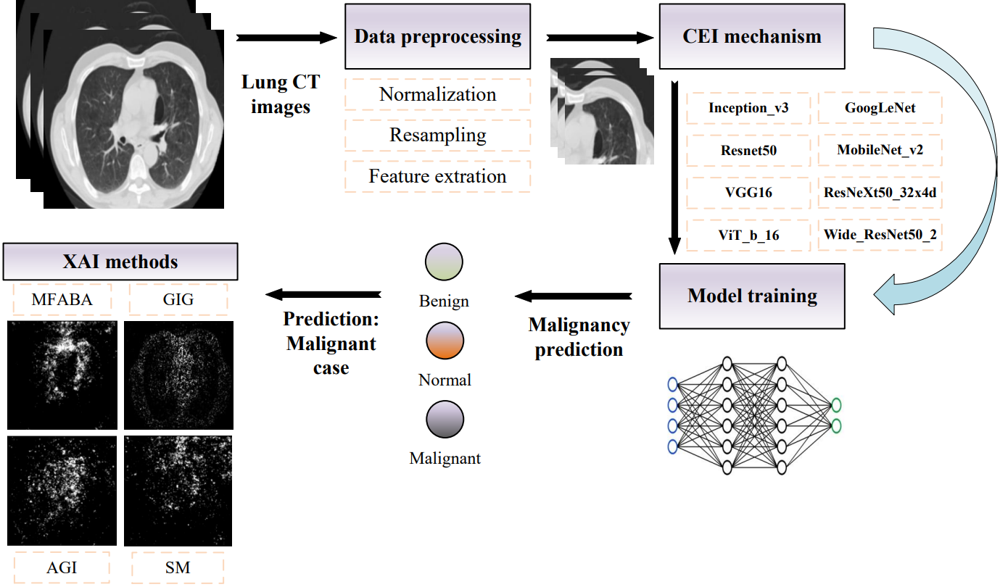

# Robust and Interpretable Lung Cancer Diagnosis via Consistency-Enhanced Explainable AI (CEI-XAI)

This repository provides the official implementation of the paper:

> **Robust and Interpretable Lung Cancer Diagnosis via Consistency-Enhanced Explainable AI**  
> *Wei Gu, Fuyang Chen, Zhan Wang*  
> *Currently under review at* ***The Visual Computer*** *journal.*

## 📌 Introduction

This work presents a novel interpretability framework for lung cancer diagnosis by combining advanced attribution methods with a Consistency-Enhanced Inference (CEI) mechanism. CEI improves model robustness against input perturbations by statistically aggregating predictions from noise-perturbed inputs, leading to more stable and faithful attributions. The framework is compatible with both CNN and ViT models and supports multiple state-of-the-art XAI techniques, including:

- **Saliency Map (SM)**  
- **Guided Integrated Gradients (GIG)**  
- **Adversarial Gradient Integration (AGI)**  
- **More Faithful and Accelerated Boundary-based Attribution (MFABA)**

Quantitative and qualitative evaluations on the IQ-OTH/NCCD lung cancer dataset demonstrate improved robustness, interpretability accuracy, and clinical relevance.

<p align="center">
  
</p>

---

## 🧠 Key Features

- CEI mechanism for prediction robustness under certified confidence bounds  
- Support for 8 deep learning architectures (CNNs and ViTs)  
- Comparative evaluation across four attribution methods  
- Quantitative metrics: Insertion, Deletion, Infidelity, and FPS  
- Clinically interpretable heatmaps and attribution maps

---

## 🚀 Getting Started

### 1. Environment Setup

Install dependencies using `pip`:

```bash
pip install -r requirements.txt
```

Python ≥3.7 and PyTorch ≥1.10 are recommended.

### 2. Dataset

Download the **IQ-OTH/NCCD Lung Cancer Dataset** from [Mendeley Data](https://data.mendeley.com/datasets/jf8bfb5xsb/1) and place it under `data/`.


### 3. Train Model and Generate Attributions

First, set your desired `model_name` in the `train.py` script (e.g., `'resnet50'`, `'inception_v3'`, etc.).
Then run the training process:

```bash
python train.py
```

After training, run the following command to compute attribution maps using MFABA with CEI smoothing enabled:

```bash
python generate_attributions.py --model_name {model_name set in train.py} --attr_method mfaba --use_smooth
```

Replace `mfaba` with `agi`, `gig`, or `sm` to test other attribution methods.

---

## 🧪 Citation

If you find this code useful for your research, please consider citing the paper:

```bibtex
@article{gu2024cei,
  title={Robust and Interpretable Lung Cancer Diagnosis via Consistency-Enhanced Explainable AI},
  author={Gu, Wei and Chen, Fuyang and Wang, Zhan},
  journal={The Visual Computer},
  year={2024},
  note={Under review},
  url={https://github.com/KxPlaug/CEI-XAI-lung-cancer-diagnosis}
}
```

> 📢 *We will update the citation entry once the paper is formally accepted.*

---

## 📮 Contact

For questions or collaborations, please contact:

**Fuyang Chen**
College of Automation Engineering, Nanjing University of Aeronautics and Astronautics
📧: [fuyang\_chen001@163.com](mailto:fuyang_chen001@163.com)

---

## 📃 License

This repository is released under the MIT License.

